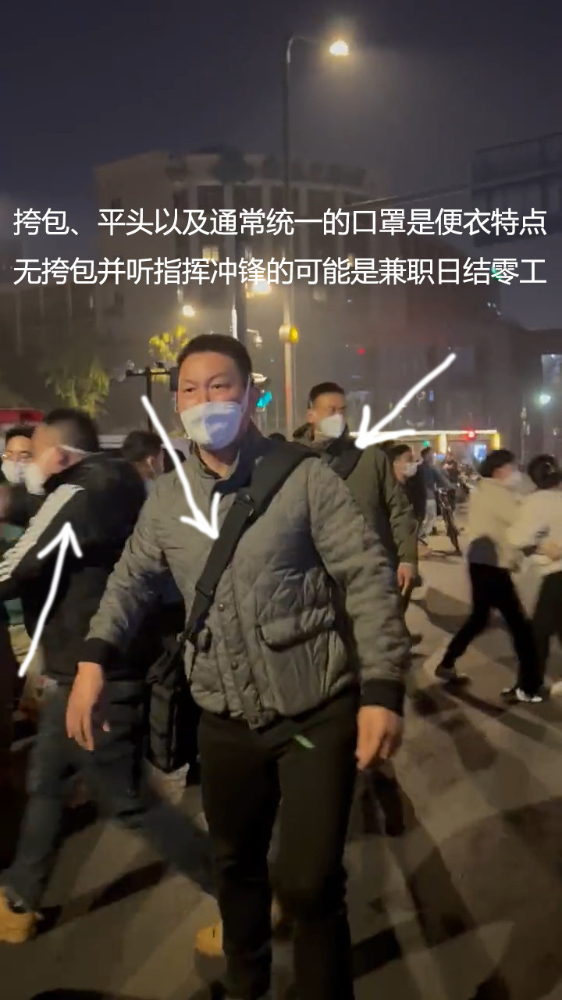

# Demonstrate-in-China
  
在不讲法律的地方如何安全参与示威

请用任何形式传播这份指南，并欢迎投稿。

## 普通人能做什么？
* 如果你能从任何途径知道你们本地的任何示威活动，请到线下参与。
* 你不需要冲在第一线，你可以只是在人群最边缘凑个数，依然起到了壮大队伍声势的作用。

## 我无法参与或本地没有示威活动怎么办？
* 转发你获取到的任何信息，尽量不要发在朋友圈或群里，1来可能会让你惹上麻烦，2来信息通常很快就会被删除（而你自己根本不知道）。
* 更好的做法是私聊中发送，并询问对方是否看见。因为QQ、微信等工具会偷偷屏蔽你发送的图片视频甚至文字消息，被偷偷屏蔽的消息不会显示发送失败，但对方却收不到，所以需要确认。

## 冲在第一线时应该如何保护自己的安全？
* 目前已知的警方惯用套路，是让一群身着便装，不明身份的男子，突然集体大喊大叫，然后对人群进行强力冲撞及推搡。  
  
  
  
* 此时你要做的就是快跑，因为人群一定会被冲散，抓人也就此开始。
* 我知道，你完全没有错。人群秩序井然，遵纪守法，和平的表达着自己的意见，却被这群人忽然撞翻在地，连打带踢。  
  
  
* 我知道你现在出离愤怒，想要跟他们争论辩法甚至打起来。
* 但现实是，他们是不讲法律的，并且他们不讲法律的行为有周围无数穿着警服的人撑腰（穿警服的是绝对不会管你被他们打的）。
* 所以更好的做法是，迅速跟随人群退散的方向，跑掉。
* 然后把你手机里珍贵的视频资料传给更多的人，发在更多的地方，让它传播得更广。
* 我钦佩那些在现场勇敢抗争最后被抓走的勇士，他们非凡的英勇有着巨大的意义。
* 但现阶段我们声音还很微弱，需要让更多的人知道，才能让他们的付出更加值得！

## 其他一些注意事项。
* 便衣最常见的特点是挎包、平头以及通常统一的口罩。无挎包并听指挥冲锋的可能是兼职日结零工。  
  
* 现场通常是断网的，警方会很快开来信号屏蔽车，所以想靠网络将内容传出去很难。
* 被抓走了也就意味着拍摄的内容绝对被删。因此务必保管好自己的视频资料，把它们活着带出来。
* 被抓走了手机会被他们拿数据线接上专用工具挖掘手机信息。是的，没有隐私，没有法律，所以出发前请先清空不必要的内容或带备用机。  
  
  
  
* 被抓走了便衣会在没人的地方打你逼你交出密码。  
  
* 手机清空不必要的内容后可以复制一些视频文件将剩余空间填满再删除这些视频文件。这样做以后，清空的内容就很难被恢复。
* 微信聊天记录被删除后是可以被轻易恢复的，所以彻底清空微信记录可能需要格式化手机后再重复上一条的步骤。
* 建议多人成行，这样一人被抓时，其他人只要迅速将警察拉开并带着朋友跑掉，通常他们不会追着你不放。
* 如果你能组建一只10人左右的队伍，通常就很难被抓了。因为你的朋友可以轻易将你拉出来并跑掉。
* 被拉出来后不要恋战，快跑。
* 如果你是一人成行，建议表现得像个吃瓜群众，随着大堆人走，避免形成落单局面。
* 落单局面下被抓，旁人通常只能喊放人的口号，这种口号实际作用有限，很难把你抢救出来。
* 再次提醒，着便衣的人会用语言或肢体持续挑衅你激怒你，例如他们会辱骂你，集体辱骂你，故意用身体撞你，把你撞翻。此时你如果跟他们理论甚至发生肢体冲突，那就中计了，会被立刻带走。千万记住，不要中计！我们应该拍下视频，然后带回来传播出去。
* 当你旁边的人正要被抓走时，请出手拉开进行救援，他们通常并不会对救援的人怎样，而你则很有机会救下这个人。
* 通常情况下，他们不会对女生动手，因为对女生动手会非常容易引发众怒。

请用任何形式传播这份指南，并欢迎投稿。
